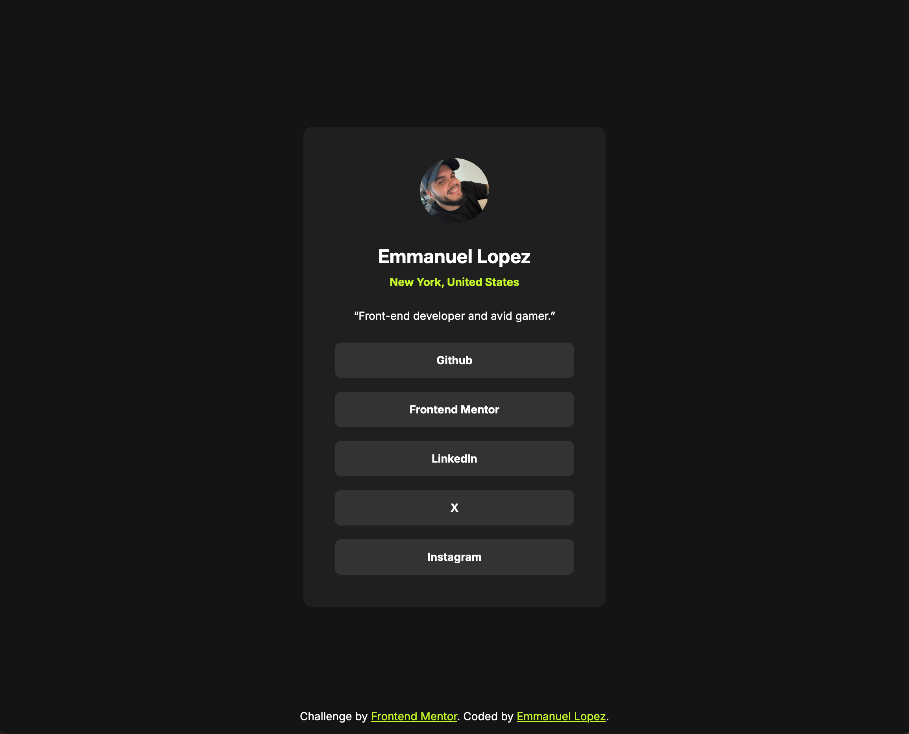

# Frontend Mentor - Social links profile solution

This is a solution to the [Social links profile challenge on Frontend Mentor](https://www.frontendmentor.io/challenges/social-links-profile-UG32l9m6dQ). Frontend Mentor challenges help you improve your coding skills by building realistic projects.

## Table of contents

- [Frontend Mentor - Social links profile solution](#frontend-mentor---social-links-profile-solution)
  - [Table of contents](#table-of-contents)
  - [Overview](#overview)
    - [The challenge](#the-challenge)
    - [Screenshot](#screenshot)
    - [Links](#links)
  - [My process](#my-process)
    - [Built with](#built-with)
    - [What I learned](#what-i-learned)
    - [Continued development](#continued-development)
  - [Author](#author)

**Note: Delete this note and update the table of contents based on what sections you keep.**

## Overview

### The challenge

Users should be able to:

-   See hover and focus states for all interactive elements on the page

### Screenshot

### Links

-   Solution URL: [https://github.com/EmLopezDev/Social-Links-Profile](https://github.com/EmLopezDev/Social-Links-Profile)
-   Live Site URL: [https://emlopezdev.github.io/Social-Links-Profile/](https://emlopezdev.github.io/Social-Links-Profile/)

## My process

### Built with

-   Semantic HTML5
-   CSS custom properties
-   Flexbox

**Note: These are just examples. Delete this note and replace the list above with your own choices**

### What I learned

-   Continued learning how to write more semantic HTML
-   Better organization within the CSS file. Kept it minimal. There was no need to use classnames since each tag only appeared one
-   Implementing better hover and focus states
-   How to keep an anchor tag within an li tag while making the whole thing clickable

### Continued development

-   Will continue writing HTML until I get to a place where I have a good grasp on semantics
-   Will continue writing simple well organized CSS files
-   Will continue incorporating my information into the challenges to make them more personal

## Author

-   Frontend Mentor - [@EmLopezDev](https://www.frontendmentor.io/profile/EmLopezDev)
